# Project: Traffic Sign Classifier

## Table of contents
1. [Overview](#Overview)
2. [Dataset Summary](#Summary)
3. [Exploratory Visualization](#visualization)
4. [Design and Model Architecture](#design)
5. [Testing Different Architectures](#architectures)
6. [Parameters Selection](#parameters)
7. [Training the Model](#train)
8. [Results of the Model](#model_results)
9. [Test Model on the New Images](#new-images)
10. [Visualization of the Network](#visualization)
11. [Test Set Analysis and Statistics](#Test-set)

Overview
---
The aim of this project is to classify the German Traffic Signs using Convolution Neural Networks

Dataset Summary
---
Numpy library is used to calculate the statistics.
- Number of training examples:  `34799`
- Number of validation examples:  `4410`
- Number of testing examples:  `12630`
- Number of classes:  `43`
- Image shape:  `(32, 32, 3)`

Exploratory Visualization
---

### Training Set
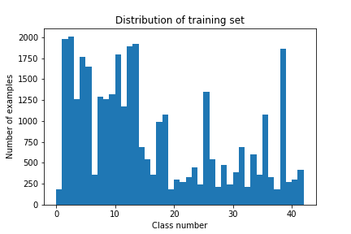

The above image shows the distribution of the training set examples. Statistics of the distribution are: 
- Total examples are `34799`
- Number of classes are `43`
- Maximum distribution is for label `2 (Speed limit (50km/h))` with `2010` examples
- Minimum distribution is for label `0 (Speed limit (20km/h))`, `19 (Dangerous curve to the left)`, `37 (Go straight or left)` with `180` examples each

### Validation Set
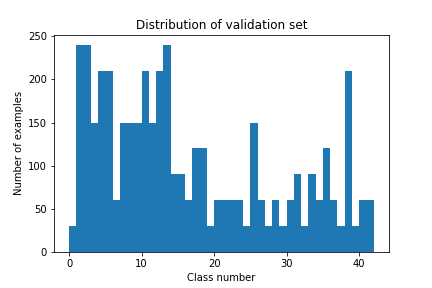

The above image shows the distribution of the validation set examples. Statistics of the distribution are:
- Total examples are `4410`
- Number of classes are `43`
- Maximum distribution is for label `1 (Speed limit (30km/h))`, `2 (Speed limit (50km/h))`, `13 (Yield)` with `240` examples each
- Minimum distribution is for label `0 (Speed limit (20km/h))`, `19 (Dangerous curve to the left)`, `24 (Road narrows on the right)`, `27 (Pedestrians)`, `29 (Bicycles crossing)`, `32 (End of all speed and passing limits)`, `37 (Go straight or left)`, `39 (Keep left)` with `30` examples each

### Testing Set
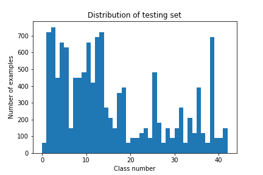

The above image shows the distribution of the testing set examples. Statistics of the distribution are:
- Total examples are `12630`
- Number of classes are `43`
- Maximum distribution is for label `2 (Speed limit (50km/h))` with `750` examples
- Minimum distribution is for label `0 (Speed limit (20km/h))`, `19 (Dangerous curve to the left)`, `27 (Pedestrians)`, `32 (End of all speed and passing limits)`, `37 (Go straight or left)` with `60` examples each

Design and Model Architecture
---

### Preprocessing [[1]](http://cs231n.github.io/neural-networks-2/#datapre), [[2]](https://becominghuman.ai/image-data-pre-processing-for-neural-networks-498289068258)
Preprocessing includes 2 steps:
- Grayscale conversion
- Mean subtraction
- Normalization

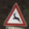

Input image

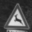

Grayscale image

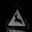

Zero-centered image (Mean subtracted image)

No other preprocessing such as rotation in considered in this project.

### Model [[3]](http://cs231n.github.io/convolutional-networks/#architectures)

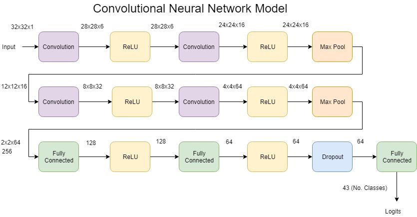

Layers and it's description

| Layer             | Description                   |
|:-----------------:|:-----------------------------:|
| Input             | 32x32x1 (Preprocessed)        |
| Convolution       | Input size: 32x32x1, Kernel size: 5, Stride: 1, Padding: Valid, Output size: 28x28x6|
| ReLU              | No change in dimensions       |
| Convolution       | Input size: 28x28x6, Kernel size: 5, Stride: 1, Padding: Valid, Output size: 24x24x16 |
| ReLU              | No change in dimensions       |
| Max. Pool         | Input size: 24x24x16, Kernel size: 2, Stride: 2, Padding: Valid, Output size: 12x12x16 |
| Convolution       | Input size: 12x12x16, Kernel size: 5, Stride: 1, Padding: Valid, Output size: 8x8x32 |
| ReLU              | No change in dimensions       |
| Convolution       | Input size: 8x8x32, Kernel size: 5, Stride: 1, Padding: Valid, Output size: 4x4x64 |
| ReLU              | No change in dimensions       |
| Max. Pool         | Input size: 4x4x64, Kernel size: 2, Stride: 2, Padding: Valid, Output size: 2x2x64 |
| Fully Connected   | Input size: 256, Output size: 128 |
| ReLU              | No change in dimensions       |
| Fully Connected   | Input size: 128, Output size: 64 |
| ReLU              | No change in dimensions       |
| Dropout           | No change in dimensions, Keep_prob = 0.5 for training set |
| Fully Connected   | Input size: 64, Output size: 43 |

Testing Different Architectures
---

### Architecture: 1
| Layer             | Description                   |
|:-----------------:|:-----------------------------:|
| Input             | 32x32x1 (Preprocessed)        |
| Convolution       | Input size: 32x32x1, Kernel size: 5, Stride: 1, Padding: Valid, Output size: 28x28x6|
| ReLU              | No change in dimensions       |
| Max. Pool         | Input size: 28x28x6, Kernel size: 2, Stride: 2, Padding: Valid, Output size: 14x14x6 |
| Convolution       | Input size: 14x14x6, Kernel size: 5, Stride: 1, Padding: Valid, Output size: 10x10x16 |
| ReLU              | No change in dimensions       |
| Max. Pool         | Input size: 10x10x16, Kernel size: 2, Stride: 2, Padding: Valid, Output size: 5x5x16 |
| Fully Connected   | Input size: 400, Output size: 120 |
| ReLU              | No change in dimensions       |
| Fully Connected   | Input size: 120, Output size: 84 |
| ReLU              | No change in dimensions       |
| Fully Connected   | Input size: 84, Output size: 43 |

#### Testing results and analysis

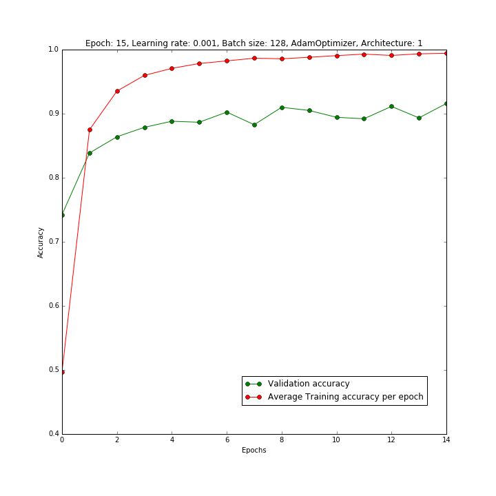

In the above graph the final validation accuray is `91.6%` whereas training accuracy is `99.4%`.
Validation accuracy is low and gap between training accuracy curve and validation accuracy curve is more. Also there is lot of fluctuation in validation accuracy plot.

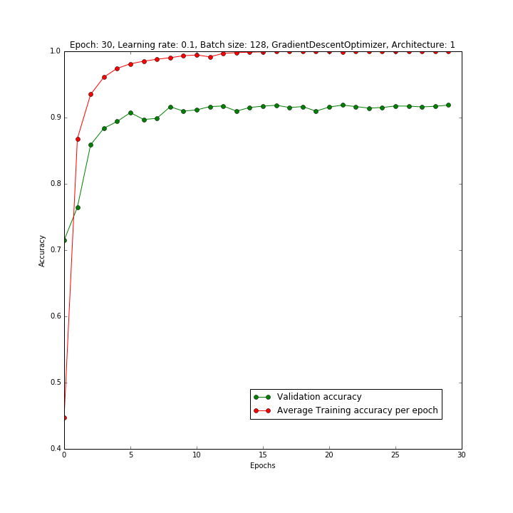

In the above graph the final validation accuray is `91.9%` whereas training accuracy is `100%`.
The validation accuracy is low and very high training accuracy.

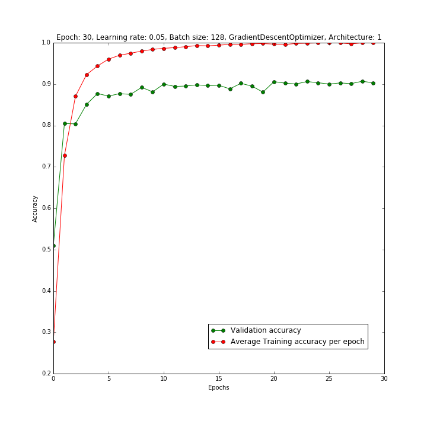

In the above graph the final validation accuracy is `90.3%` whereas training accuracy is `99.99%`
The validation accuracy is low compared to very high training accuracy.

From the above 3 graphs, with different parameters we see a low validation accuracy, a high training accuracy and the gap between the validation accuracy curve and training accuracy curve is more which implies over-fitting [[4]](http://cs231n.github.io/neural-networks-3/#accuracy).

### Architecture: 2
| Layer             | Description                   |
|:-----------------:|:-----------------------------:|
| Input             | 32x32x1 (Preprocessed)        |
| Convolution       | Input size: 32x32x1, Kernel size: 5, Stride: 1, Padding: Valid, Output size: 28x28x6|
| ReLU              | No change in dimensions       |
| Convolution       | Input size: 28x28x6, Kernel size: 5, Stride: 1, Padding: Valid, Output size: 24x24x16 |
| ReLU              | No change in dimensions       |
| Max. Pool         | Input size: 24x24x16, Kernel size: 2, Stride: 2, Padding: Valid, Output size: 12x12x16 |
| Convolution       | Input size: 12x12x16, Kernel size: 5, Stride: 1, Padding: Valid, Output size: 8x8x32 |
| ReLU              | No change in dimensions       |
| Convolution       | Input size: 8x8x32, Kernel size: 5, Stride: 1, Padding: Valid, Output size: 4x4x64 |
| ReLU              | No change in dimensions       |
| Max. Pool         | Input size: 4x4x64, Kernel size: 2, Stride: 2, Padding: Valid, Output size: 2x2x64 |
| Fully Connected   | Input size: 256, Output size: 128 |
| ReLU              | No change in dimensions       |
| Fully Connected   | Input size: 128, Output size: 64 |
| ReLU              | No change in dimensions       |
| Dropout           | No change in dimensions, Keep_prob = 0.5 for training set |
| Fully Connected   | Input size: 64, Output size: 43 |

#### Testing results and analysis

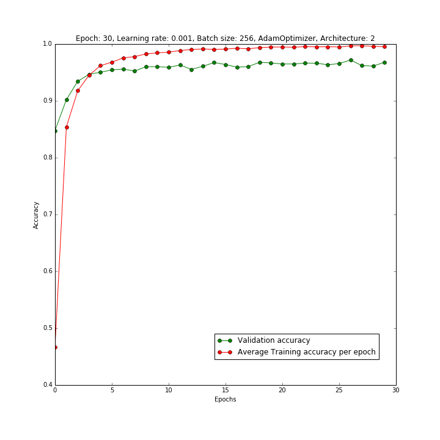

In the above graph, the validation accuracy is `96.8%` and training accuracy is `99.5%`. The validation accuracy curve and training accuracy curve are close enough and validation accuracy is not low compared to the training accuracy.

In the above graph, the validation accuracy is `94.2%` and training accuracy is `96.6%`. The validation accuracy curve and training accuracy curve are close enough and validation accuracy is not low compared to the training accuracy.

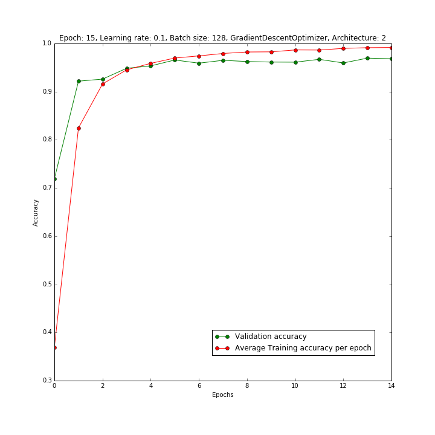

In the above graph, the validation accuracy is `96.8%` and training accuracy is `99.1%`. The validation accuracy in this case is not very low compared to the training accuracy and validation accuracy curve is close enough to the training accuracy curve.

**_Hence from the above graphs and analysis I concluded to use `Architecture: 2`._**

Parameters Selection
---
#### Learning rate and epoch comparisons:

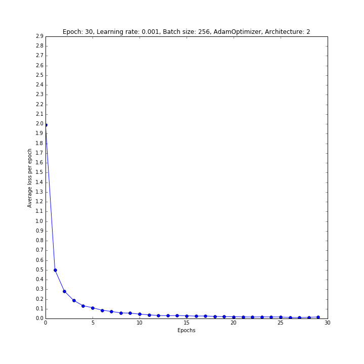
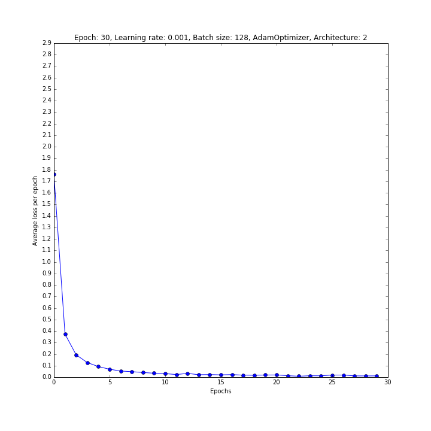
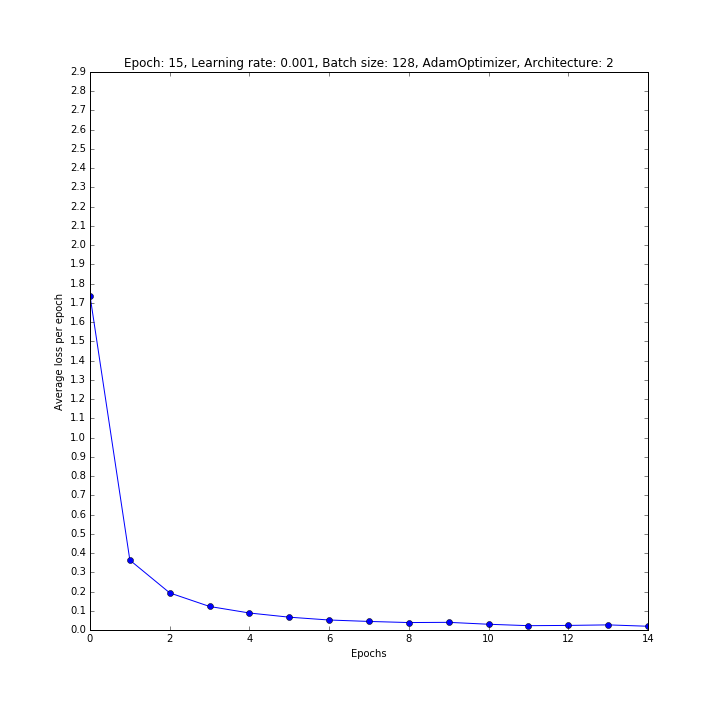
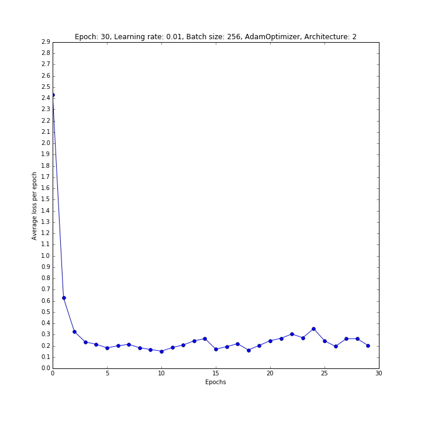

The above 4 graphs are with `AdamOptimizer` with different learning rate, epochs and batch size

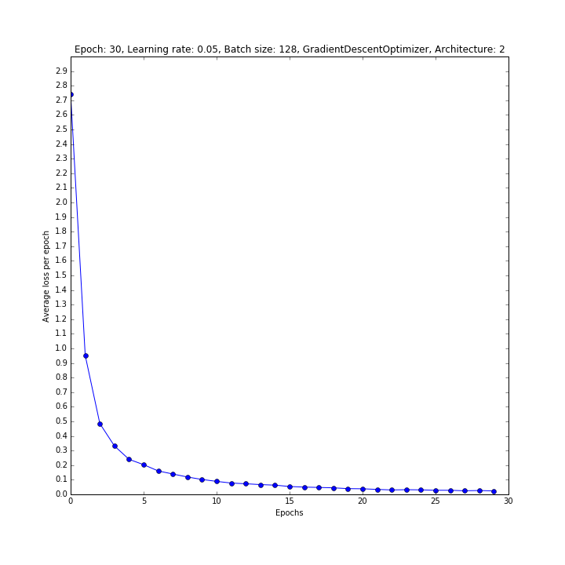
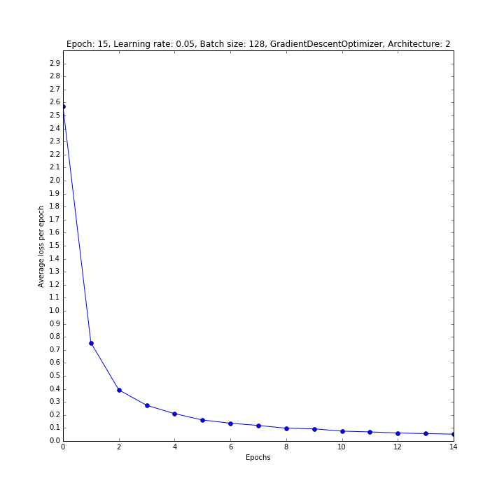

The above graphs are with `GradientDescentOptimizer` with similar parameters as that of `AdamOptimizer`. The `GradientDescentOptimizer` has the better learning rate curve compared to `AdamOptimizer`. **_Hence I concluded to go with `GradientDescentOptimizer`_**

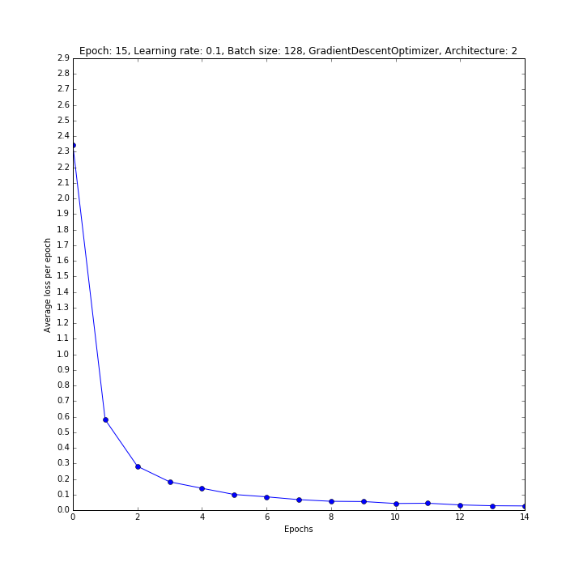
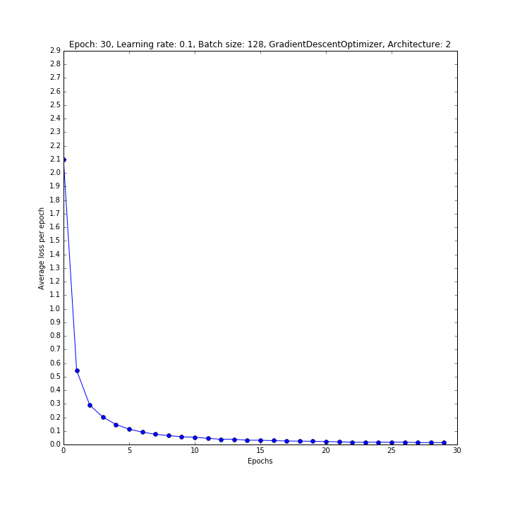
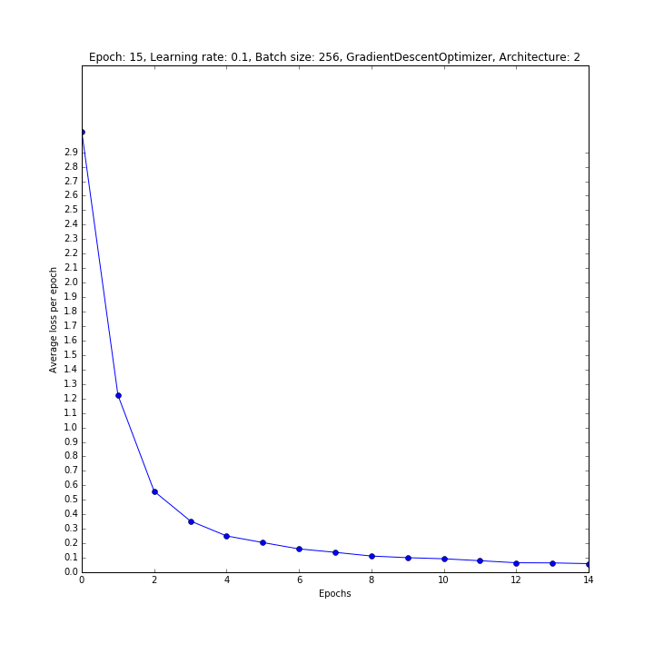
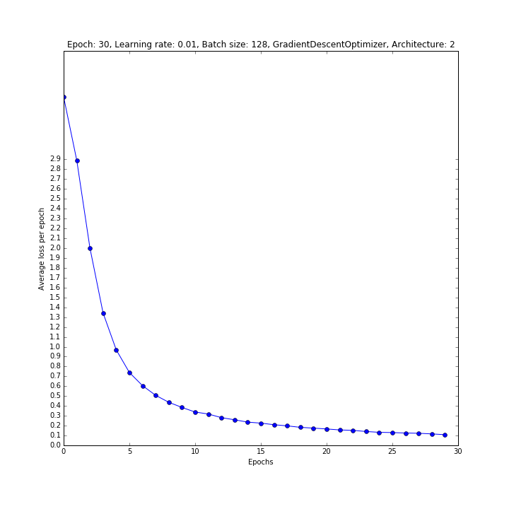

With the help of above graphs and in comparison with validation and training accuracies, I chose the parameters with `learning rate = 0.01`, `batch size = 128` and `number of epochs = 30`

Training the Model
---

Model is trained with the following configuration
- Architecture: 2
- Learning rate: 0.01 
- Number of epochs: 30
- Batch size: 128
- Optimizer: GradientDescentOptimizer

Results of the Model
---
- Training accuracy: ~ 98%
- Validation accuracy: ~ 96%
- Testing accuracy: ~ 94.5%

Test Model on the New Images
---
<!-- ### Visualization of the Images
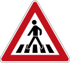

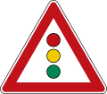
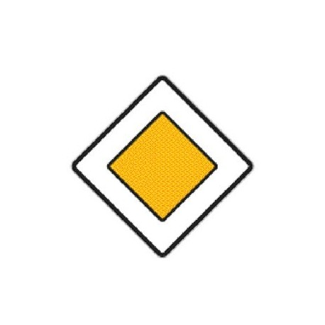

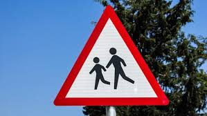

  
 -->

### Predictions

|Image Name | Image | Correct Label | Network Predictions |
|:----:|:-----:|:-------------:|:-----------------:|
| Pedestrians|  | 27 (Pedestrians) | 27 (Pedestrians) |
| No overtaking |  | 9 (No Passing) | 9 (No Passing) |
|Traffic signal ahead |  | 26 (Traffic Signals) | 26 (Traffic Signals) |
|Priority road |  | 12 (Priority road) | 12 (Priority road) |
| Keep right |  | 38 (Keep right) | 38 (Keep right) |
| Children crossing |  | 28 (Children Crossing) |  11 (Right-of-way at the next intersection) |
| Yield |  | 13 (Yield) | 18 (General caution) |
|70 kmph |  | 4 (Speed Limit (70km/h)) | 33 (Turn right ahead) |
| Stop |  | 14 (Stop) | 31 (Wild animals crossing) |
| Yield | 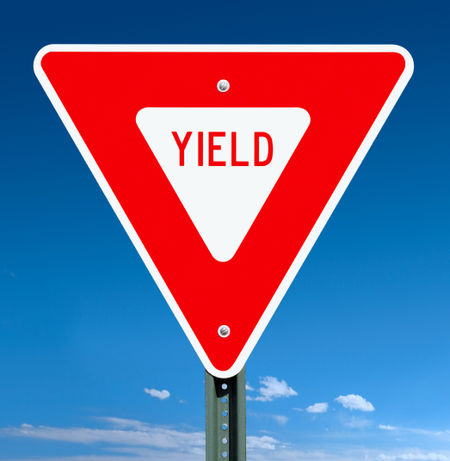 | 13 (Yield) | 13 (Yield) |

### Top 5 predictions

1. Pedestrians
    - Correct Label: 27
    - Top 5 Predictions

|Index | Softmax Probabilities | Predicted Label | Sign Name |
|:-----:|:-----:|:-------------:|:-----------------:|
| 1 | 1.000 | 27 |	Pedestrians |
| 2 | 0.000 | 18 | General caution |
| 3	| 0.000	| 11 | Right-of-way at the next intersection |
| 4 |	0.000	| 26	| Traffic signals |
| 5 |	0.000	| 25	| Road work |

2. No overtaking
    - Correct Label: 9
    - Top 5 Predictions

|Index | Softmax Probabilities | Predicted Label | Sign Name |
|:-----:|:-----:|:-------------:|:-----------------:|
| 1 | 0.989	| 9	| No passing |
| 2	| 0.011	| 41	| End of no passing |
| 3	| 0.000	| 40	| Roundabout mandatory |
| 4	| 0.000	| 12	| Priority road |
| 5	| 0.000	| 10	| No passing for vehicles over 3.5 metric tons |

3. Traffic signal ahead
    - Correct Label: 26
    - Top 5 Predictions

|Index | Softmax Probabilities | Predicted Label | Sign Name |
|:-----:|:-----:|:-------------:|:-----------------:|
| 1 |	1.000	| 26	| Traffic signals
| 2 |	0.000	| 18	| General caution
| 3 |	0.000	| 27	| Pedestrians
| 4 |	0.000	| 24	| Road narrows on the right
| 5 |	0.000	| 20	| Dangerous curve to the right

4. Priority road
    - Correct Label: 12
    - Top 5 Predictions

|Index | Softmax Probabilities | Predicted Label | Sign Name |
|:-----:|:-----:|:-------------:|:-----------------:|
| 1 |	1.000	| 12	| Priority road
| 2 |	0.000	| 40	| Roundabout mandatory
| 3 |	0.000	| 9	| No passing
| 4 |	0.000	| 11	| Right-of-way at the next intersection
| 5 |	0.000	| 32	| End of all speed and passing limits

5. Keep right
    - Correct Label: 38
    - Top 5 Predictions

|Index | Softmax Probabilities | Predicted Label | Sign Name |
|:-----:|:-----:|:-------------:|:-----------------:|
| 1 |	1.000	| 38	| Keep right
| 3 |	0.000	| 25	| Road work
| 2 |	0.000	| 31	| Wild animals crossing
| 4 |	0.000	| 23	| Slippery road
| 5 |	0.000	| 32	| End of all speed and passing limits

6. Children crossing
    - Correct Label: 28
    - Top 5 Predictions

|Index | Softmax Probabilities | Predicted Label | Sign Name |
|:-----:|:-----:|:-------------:|:-----------------:|
| 1 |	0.987	| 11	| Right-of-way at the next intersection |
| 2 |	0.004	| 20	| Priority road |
| 3 |	0.004	| 40	| Roundabout mandatory |
| 4 |	0.003	| 30	| Pedestrians |
| 5 |	0.001	| 22	| General caution |

7. Yield
    - Correct Label: 13
    - Top 5 Predictions

|Index | Softmax Probabilities | Predicted Label | Sign Name |
|:-----:|:-----:|:-------------:|:-----------------:|
| 1 |	0.913	| 18	| General caution |
| 2 |	0.082	| 42	| End of no passing by vehicles over 3.5 metric tons |
| 3 |	0.002	| 12	| Priority road |
| 4 |	0.001	| 41	| End of no passing |
| 5 |	0.001	| 11	| Right-of-way at the next intersection |

8. 70 kmph
    - Correct Label: 4
    - Top 5 Predictions

|Index | Softmax Probabilities | Predicted Label | Sign Name |
|:-----:|:-----:|:-------------:|:-----------------:|
| 1 |	0.897	| 33	| Turn right ahead |
| 2 |	0.068	| 14	| Stop |
| 3 |	0.033	| 12	| Priority road |
| 4 |	0.001	| 33	| Roundabout mandatory |
| 5 |	0.000	| 11	| Right-of-way at the next intersection |

9. Stop
    - Correct Label: 14
    - Top 5 Predictions

|Index | Softmax Probabilities | Predicted Label | Sign Name |
|:-----:|:-----:|:-------------:|:-----------------:|
| 1 |	0.356	| 31	| Wild animals crossing |
| 2 |	0.297	| 36	| Go straight or right |
| 3 |	0.157	| 35	| Ahead only |
| 4 |	0.072	| 3	| Speed limit (60km/h) |
| 5 |	0.045	| 33	| Turn right ahead |

### Conclusions

From the above table of network predictions we can see that network performed well on only traffic sign images with plain / no background. It didn't perform well for the images with some background.

Visualization of the Network
---

After Convolution Layer

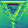 
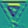
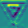
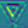
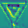

After ReLU Layer

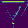 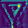
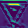
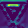

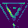

After Convolution Layer

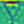 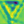
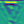
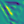
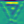
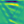
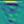
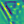

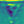
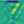
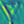
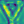
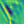

After ReLU Layer

 

After Max Pool Layer

 

Test Set Analysis and Statistics
---

Performance Analysis for some of the labels in the test set:

Label: 5 (Speed limit (80km/h))
- True Positives:  561.0
- False Positives:  34.0
- False Negatives:  69.0
- Precision: 0.943
- Recall: 0.890
------------------------------------------------------------------------------------------
Label: 6 (End of speed limit (80km/h))
- True Positives:  129.0
- False Positives:  1.0
- False Negatives:  21.0
- Precision: 0.992
- Recall: 0.860
------------------------------------------------------------------------------------------
Label: 18 (General caution)
- True Positives:  335.0
- False Positives:  36.0
- False Negatives:  55.0
- Precision: 0.903
- Recall: 0.859
------------------------------------------------------------------------------------------
Label: 31 (Wild animals crossing)
- True Positives:  262.0
- False Positives:  15.0
- False Negatives:  8.0
- Precision: 0.946
- Recall: 0.970
------------------------------------------------------------------------------------------
Label: 42 (End of no passing by vehicles over 3.5 metric tons)
- True Positives:  76.0
- False Positives:  1.0
- False Negatives:  14.0
- Precision: 0.987
- Recall: 0.844
------------------------------------------------------------------------------------------
Label: 7 (Speed limit (100km/h))
- True Positives:  412.0
- False Positives:  29.0
- False Negatives:  38.0
- Precision: 0.934
- Recall: 0.916
------------------------------------------------------------------------------------------
Label: 2 (Speed limit (50km/h))
- True Positives:  739.0
- False Positives:  47.0
- False Negatives:  11.0
- Precision: 0.940
- Recall: 0.985
------------------------------------------------------------------------------------------
