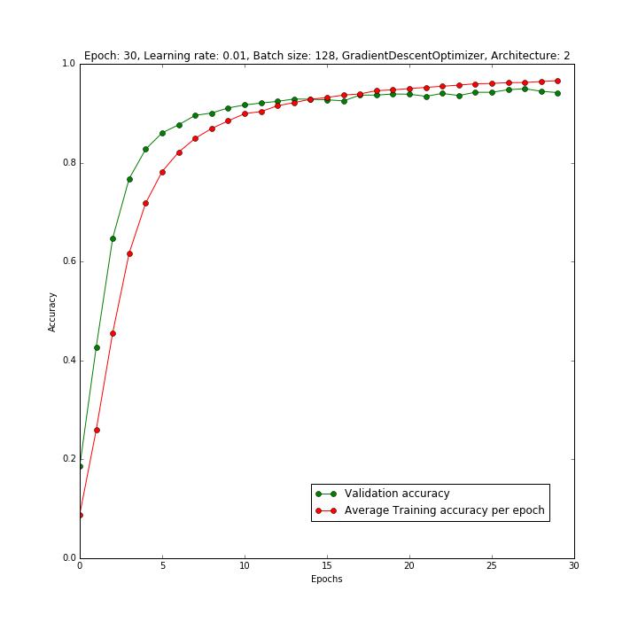
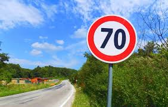
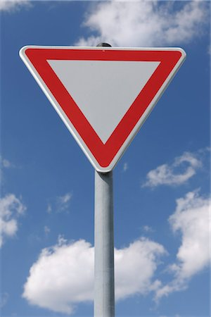

# Project: Traffic Sign Classifier

## Table of contents
1. [Overview](#Overview)
2. [Dataset Summary](#Summary)
3. [Exploratory Visualization](#visualization)
4. [Design and Model Architecture](#design)
5. [Testing Different Architectures](#architectures)
6. [Parameters Selection](#parameters)
7. [Training the Model](#train)
8. [Results of the Model](#model_results)
9. [Test Model on the New Images](#new-images)

Overview
---
The aim of this project is to classify the German Traffic Signs using Convolution Neural Networks

Dataset Summary
---
Numpy library is used to calculate the statistics.
- Number of training examples:  `34799`
- Number of validation examples:  `4410`
- Number of testing examples:  `12630`
- Number of classes:  `43`
- Image shape:  `(32, 32, 3)`

Exploratory Visualization
---
### Training Set

The above image shows the distribution of the training set examples. Statistics of the distribution are: 
- Total examples are `34799`
- Number of classes are `43`
- Maximum distribution is for label `2 (Speed limit (50km/h))` with `2010` examples
- Minimum distribution is for label `0 (Speed limit (20km/h))`, `19 (Dangerous curve to the left)`, `37 (Go straight or left)` with `180` examples each

### Validation Set

The above image shows the distribution of the validation set examples. Statistics of the distribution are:
- Total examples are `4410`
- Number of classes are `43`
- Maximum distribution is for label `1 (Speed limit (30km/h))`, `2 (Speed limit (50km/h))`, `13 (Yield)` with `240` examples each
- Minimum distribution is for label `0 (Speed limit (20km/h))`, `19 (Dangerous curve to the left)`, `24 (Road narrows on the right)`, `27 (Pedestrians)`, `29 (Bicycles crossing)`, `32 (End of all speed and passing limits)`, `37 (Go straight or left)`, `39 (Keep left)` with `30` examples each

Design and Model Architecture
---

### Preprocessing [[1]](http://cs231n.github.io/neural-networks-2/#datapre), [[2]](https://becominghuman.ai/image-data-pre-processing-for-neural-networks-498289068258)
Preprocessing includes 2 steps:
- Mean subtraction
- Normalization

Input image

Zero-centered image (Mean subtracted image)

No other preprocessing such as rotation in considered because assuming the camera in the car in mounted straight and traffic sign boards are always straight.

### Model [[3]](http://cs231n.github.io/convolutional-networks/#architectures)

Layers and it's description

| Layer             | Description                   |
|:-----------------:|:-----------------------------:|
| Input             | 32x32x1 (Preprocessed)        |
| Convolution       | Input size: 32x32x1, Kernel size: 5, Stride: 1, Padding: Valid, Output size: 28x28x6|
| ReLU              | No change in dimensions       |
| Convolution       | Input size: 28x28x6, Kernel size: 5, Stride: 1, Padding: Valid, Output size: 24x24x16 |
| ReLU              | No change in dimensions       |
| Max. Pool         | Input size: 24x24x16, Kernel size: 2, Stride: 2, Padding: Valid, Output size: 12x12x16 |
| Convolution       | Input size: 12x12x16, Kernel size: 5, Stride: 1, Padding: Valid, Output size: 8x8x32 |
| ReLU              | No change in dimensions       |
| Convolution       | Input size: 8x8x32, Kernel size: 5, Stride: 1, Padding: Valid, Output size: 4x4x64 |
| ReLU              | No change in dimensions       |
| Max. Pool         | Input size: 4x4x64, Kernel size: 2, Stride: 2, Padding: Valid, Output size: 2x2x64 |
| Fully Connected   | Input size: 256, Output size: 128 |
| ReLU              | No change in dimensions       |
| Fully Connected   | Input size: 128, Output size: 64 |
| ReLU              | No change in dimensions       |
| Dropout           | No change in dimensions, Keep_prob = 0.5 for training set |
| Fully Connected   | Input size: 64, Output size: 43 |
|

Testing Different Architectures
---

### Architecture: 1
| Layer             | Description                   |
|:-----------------:|:-----------------------------:|
| Input             | 32x32x1 (Preprocessed)        |
| Convolution       | Input size: 32x32x1, Kernel size: 5, Stride: 1, Padding: Valid, Output size: 28x28x6|
| ReLU              | No change in dimensions       |
| Max. Pool         | Input size: 28x28x6, Kernel size: 2, Stride: 2, Padding: Valid, Output size: 14x14x6 |
| Convolution       | Input size: 14x14x6, Kernel size: 5, Stride: 1, Padding: Valid, Output size: 10x10x16 |
| ReLU              | No change in dimensions       |
| Max. Pool         | Input size: 10x10x16, Kernel size: 2, Stride: 2, Padding: Valid, Output size: 5x5x16 |
| Fully Connected   | Input size: 400, Output size: 120 |
| ReLU              | No change in dimensions       |
| Fully Connected   | Input size: 120, Output size: 84 |
| ReLU              | No change in dimensions       |
| Fully Connected   | Input size: 84, Output size: 43 |
|

#### Testing results and analysis

In the above graph the final validation accuray is `91.6%` whereas training accuracy is `99.4%`.
Validation accuracy is low and gap between training accuracy curve and validation accuracy curve is more. Also there is lot of fluctuation in validation accuracy plot.

In the above graph the final validation accuray is `91.9%` whereas training accuracy is `100%`.
The validation accuracy is low and very high training accuracy.

In the above graph the final validation accuracy is `90.3%` whereas training accuracy is `99.99%`
The validation accuracy is low compared to very high training accuracy.

From the above 3 graphs, with different parameters we see a low validation accuracy, a high training accuracy and the gap between the validation accuracy curve and training accuracy curve is more which implies over-fitting [[4]](http://cs231n.github.io/neural-networks-3/#accuracy).

### Architecture: 2
| Layer             | Description                   |
|:-----------------:|:-----------------------------:|
| Input             | 32x32x1 (Preprocessed)        |
| Convolution       | Input size: 32x32x1, Kernel size: 5, Stride: 1, Padding: Valid, Output size: 28x28x6|
| ReLU              | No change in dimensions       |
| Convolution       | Input size: 28x28x6, Kernel size: 5, Stride: 1, Padding: Valid, Output size: 24x24x16 |
| ReLU              | No change in dimensions       |
| Max. Pool         | Input size: 24x24x16, Kernel size: 2, Stride: 2, Padding: Valid, Output size: 12x12x16 |
| Convolution       | Input size: 12x12x16, Kernel size: 5, Stride: 1, Padding: Valid, Output size: 8x8x32 |
| ReLU              | No change in dimensions       |
| Convolution       | Input size: 8x8x32, Kernel size: 5, Stride: 1, Padding: Valid, Output size: 4x4x64 |
| ReLU              | No change in dimensions       |
| Max. Pool         | Input size: 4x4x64, Kernel size: 2, Stride: 2, Padding: Valid, Output size: 2x2x64 |
| Fully Connected   | Input size: 256, Output size: 128 |
| ReLU              | No change in dimensions       |
| Fully Connected   | Input size: 128, Output size: 64 |
| ReLU              | No change in dimensions       |
| Dropout           | No change in dimensions, Keep_prob = 0.5 for training set |
| Fully Connected   | Input size: 64, Output size: 43 |
|

#### Testing results and analysis

In the above graph, the validation accuracy is `96.8%` and training accuracy is `99.5%`. The validation accuracy curve and training accuracy curve are close enough and validation accuracy is not low compared to the training accuracy.

In the above graph, the validation accuracy is `94.2%` and training accuracy is `96.6%`. The validation accuracy curve and training accuracy curve are close enough and validation accuracy is not low compared to the training accuracy.

In the above graph, the validation accuracy is `96.8%` and training accuracy is `99.1%`. The validation accuracy in this case is not very low compared to the training accuracy and validation accuracy curve is close enough to the training accuracy curve.

**_Hence from the above graphs and analysis I concluded to use `Architecture: 2`._**

Parameters Selection
---
#### Learning rate and epoch comparisons:

The above 4 graphs are with `AdamOptimizer` with different learning rate, epochs and batch size

The above graphs are with `GradientDescentOptimizer` with similar parameters as that of `AdamOptimizer`. The `GradientDescentOptimizer` has the better learning rate curve compared to `AdamOptimizer`. **_Hence I concluded to go with `GradientDescentOptimizer`_**

With the help of above graphs and in comparison with validation and training accuracies, I chose the parameters with `learning rate = 0.01`, `batch size = 128` and `number of epochs = 30`

Training the Model
---

Model is trained with the following configuration
- Architecture: 2
- Learning rate: 0.01 
- Number of epochs: 30
- Batch size: 128
- Optimizer: GradientDescentOptimizer

Results of the Model
---
- Training accuracy: ~ 98%
- Validation accuracy: ~ 96%
- Testing accuracy: ~ 94.5%

Test Model on the New Images
---
<!-- ### Visualization of the Images

  
 -->

### Predictions

|Image Name | Image | Correct Label | Network Predictions |
|:----:|:-----:|:-------------:|:-----------------:|
| Pedestrians|  | 27 (Pedestrians) | 27 (Pedestrians) |
| No overtaking |  | 9 (No Passing) | 9 (No Passing) |
|Traffic signal ahead |  | 26 (Traffic Signals) | 26 (Traffic Signals) |
|Priority road |  | 12 (Priority road) | 12 (Priority road) |
| Keep right |  | 38 (Keep right) | 38 (Keep right) |
| Children crossing |  | 28 (Children Crossing) | 28 (Children Crossing) |
| Yield |  | 13 (Yield) | 36 (Go straight or right) |
|70 kmph |  | 4 (Speed Limit (70km/h)) | 26 (Traffic Signals) |
| Stop |  | 14 (Stop) | 36 (Go straight or right) |
||

### Top 5 predictions

1. Pedestrians
    - Correct Label: 27
    - Top 5 Predictions

|Index | Softmax Probabilities | Predicted Label | Sign Name |
|:-----:|:-----:|:-------------:|:-----------------:|
|1 | 0.834 | 27 |	Pedestrians |
| 2 | 0.095 | 18 | General caution |
| 3	| 0.071	| 11 | Right-of-way at the next intersection |
| 4 |	0.000	| 30	| Beware of ice/snow |
|5 |	0.000	| 24	| Road narrows on the right |
|

2. No overtaking
    - Correct Label: 9
    - Top 5 Predictions

|Index | Softmax Probabilities | Predicted Label | Sign Name |
|:-----:|:-----:|:-------------:|:-----------------:|
| 1 | 1.000	| 9	| No passing |
| 2	| 0.000	| 10	| No passing for vehicles over 3.5 metric tons |
| 3	| 0.000	| 26	| Traffic signals |
| 4	| 0.000	| 20	| Dangerous curve to the right |
| 5	| 0.000	| 16	| Vehicles over 3.5 metric tons prohibited |
|

3. Traffic signal ahead
    - Correct Label: 26
    - Top 5 Predictions

|Index | Softmax Probabilities | Predicted Label | Sign Name |
|:-----:|:-----:|:-------------:|:-----------------:|
|1 |	1.000	| 26	| Traffic signals
|2 |	0.000	| 18	| General caution
|3 |	0.000	| 22	| Bumpy road
|4 |	0.000	| 29	| Bicycles crossing
|5 |	0.000	| 20	| Dangerous curve to the right
|

4. Priority road
    - Correct Label: 12
    - Top 5 Predictions

|Index | Softmax Probabilities | Predicted Label | Sign Name |
|:-----:|:-----:|:-------------:|:-----------------:|
| 1 |	1.000	| 12	| Priority road
| 2 |	0.000	| 15	| No vehicles
| 3 |	0.000	| 26	| Traffic signals
| 4 |	0.000	| 13	| Yield
| 5 |	0.000	| 29	| Bicycles crossing
|

5. Keep right
    - Correct Label: 38
    - Top 5 Predictions

|Index | Softmax Probabilities | Predicted Label | Sign Name |
|:-----:|:-----:|:-------------:|:-----------------:|
| 1 |	1.000	| 38	| Keep right
| 2 |	0.000	| 31	| Wild animals crossing
| 3 |	0.000	| 34	| Turn left ahead
| 4 |	0.000	| 36	| Go straight or right
| 5 |	0.000	| 35	| Ahead only
|

6. Children crossing
    - Correct Label: 28
    - Top 5 Predictions

|Index | Softmax Probabilities | Predicted Label | Sign Name |
|:-----:|:-----:|:-------------:|:-----------------:|
| 1 |	0.975	| 28	| Children crossing |
| 2 |	0.025	| 20	| Dangerous curve to the right |
| 3 |	0.000	| 29	| Bicycles crossing |
| 4 |	0.000	| 30	| Beware of ice/snow |
| 5 |	0.000	| 22	| Bumpy road |
|

7. Yield
    - Correct Label: 13
    - Top 5 Predictions

|Index | Softmax Probabilities | Predicted Label | Sign Name |
|:-----:|:-----:|:-------------:|:-----------------:|
| 1 |	0.958	| 36	| Go straight or right |
| 2 |	0.027	| 12	| Priority road |
| 3 |	0.010	| 26	| Traffic signals |
| 4 |	0.005	| 35	| Ahead only |
| 5 |	0.000	| 33	| Turn right ahead |
|

8. 70 kmph
    - Correct Label: 4
    - Top 5 Predictions

|Index | Softmax Probabilities | Predicted Label | Sign Name |
|:-----:|:-----:|:-------------:|:-----------------:|
| 1 |	0.731	| 26	| Traffic signals |
| 2 |	0.181	| 17	| No entry |
| 3 |	0.035	| 11	| Right-of-way at the next intersection |
| 4 |	0.022	| 33	| Turn right ahead |
| 5 |	0.020	| 12	| Priority road |
|

9. Stop
    - Correct Label: 14
    - Top 5 Predictions

|Index | Softmax Probabilities | Predicted Label | Sign Name |
|:-----:|:-----:|:-------------:|:-----------------:|
| 1 |	0.981	| 36	| Go straight or right |
| 2 |	0.018	| 17	| No entry |
| 3 |	0.001	| 26	| Traffic signals |
| 4 |	0.000	| 12	| Priority road |
| 5 |	0.000	| 11	| Right-of-way at the next intersection |
|

### Conclusions

From the above table of network predictions we can see that network performed well on only traffic sign images with plain / no background. It didn't perform well for the images with some background. However `Children Crossing` image is correctly classified even with the background.